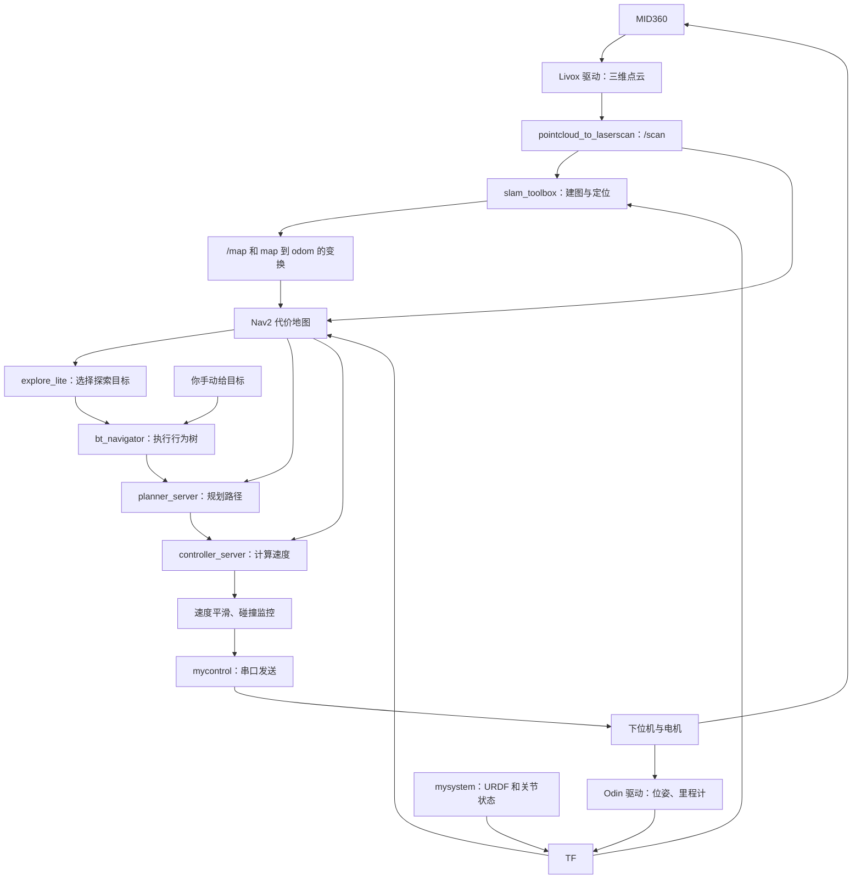

# 导航系统说明与避坑指南

整理日期：2026-09-20。适用环境：当前工作空间 `/home/future/D/navigate`、ROS 2 Jazzy。

本文整理了本次交流中的系统逻辑、行为树接入、启动方法、排查方式和优化建议，并根据当前代码补充易踩坑事项。

**当前状态：已有传感器、TF、建图、Nav2、自动探索和底盘串口控制的代码框架；尚未完成实车整链路验证。** 新增的 `my_bt` 包已做过构建、launch 参数解析、配置重写和 lint/XML 检查。这些检查不能证明实车导航已经跑通。

本文中的“已确认”表示能从代码或配置直接看到；“待实测”表示还需要连接硬件验证；“建议”表示尚未实施。本文的整理没有修改运行逻辑。

现场使用可先看简版：[上车操作清单](上车操作清单.md)。

## 目录

1. [先看整套系统在做什么](#1-先看整套系统在做什么)
2. [ROS 2 常见名词](#2-ros-2-常见名词)
3. [目录和模块分工](#3-目录和模块分工)
4. [硬件输入：MID360 和 Odin](#4-硬件输入mid360-和-odin)
5. [机器人模型与 TF](#5-机器人模型与-tf)
6. [扫描、建图和代价地图](#6-扫描建图和代价地图)
7. [自动探索和导航的分工](#7-自动探索和导航的分工)
8. [行为树如何与导航连接](#8-行为树如何与导航连接)
9. [从速度指令到电机](#9-从速度指令到电机)
10. [启动方法：按目的选择一套](#10-启动方法按目的选择一套)
11. [如何调用行为树](#11-如何调用行为树)
12. [排查命令与判断方法](#12-排查命令与判断方法)
13. [易踩坑事项](#13-易踩坑事项)
14. [优化建议与优先级](#14-优化建议与优先级)
15. [建议的实车验证顺序](#15-建议的实车验证顺序)
16. [修改文件与参数速查](#16-修改文件与参数速查)

## 1. 先看整套系统在做什么

小车需要持续回答四个问题：

1. 周围有什么？——传感器、扫描和地图。
2. 我在哪里？——里程计、TF 和建图定位。
3. 下一步去哪里？——你手动给目标，或者自动探索选择目标。
4. 怎样过去？——Nav2 规划、控制和行为树。



如果阅读器不支持 Mermaid，可以看这条文字链：

```text
感知环境和自身运动 → 建图与定位 → 选择目标 → 规划路径
    → 实时控制 → 发送速度 → 小车移动 → 重新观测
```

各模块并行运行，通过消息交换信息。这是一套循环系统，不是启动时只执行一遍的脚本。

## 2. ROS 2 常见名词

| 名词 | 含义 | 本项目例子 |
| --- | --- | --- |
| 软件包 package | 组织相关程序、配置和资源的单位 | `mycontrol`、`myexplore` |
| 节点 node | 正在运行并负责某项工作的程序 | 建图节点、底盘控制节点 |
| 话题 topic | 持续传递数据的通道，可有多个订阅者 | `/scan`、`/cmd_vel` |
| 消息类型 | 数据的格式 | `LaserScan`、`Twist` |
| 服务 service | 发出一次请求并得到响应 | 清除代价地图 |
| 动作 action | 可反馈进度、可取消的较长任务 | 导航到目标 |
| 参数 parameter | 一个节点使用的设置 | 速度上限、里程计话题 |
| launch | 启动程序、传参数、组合其他启动文件 | `navigation.launch.py` |
| YAML | 存放参数的文本文件 | `nav2_params.yaml` |
| TF | 不同坐标系之间的位置、姿态关系 | `map → odom → … → base_link` |
| 行为树 BT | 根据执行状态组织任务和恢复动作 | `navigate_to_pose.xml` |
| 插件 plugin | 由宿主加载、完成某种功能的实现 | 规划器、控制器、BT 节点 |

例如：

```bash
ros2 launch my_bt navigation.launch.py
```

表示从 `my_bt` 包找到这个 launch 文件，按它的描述启动系统。真正持续计算路径的是节点。

同名参数属于不同节点时互不共享。在 `bt_navigator` 中写了 `odom_topic`，不会自动给 `controller_server` 设置同一个参数。

## 3. 目录和模块分工

| 路径 | ROS 包名 | 主要职责 |
| --- | --- | --- |
| [src/mysystem](src/mysystem) | `mysystem` | URDF、机器人部件 TF、RViz/Foxglove |
| [src/mycontrol](src/mycontrol) | `mycontrol` | 底盘速度转串口；其 launch 还启动两套传感器驱动 |
| [src/myexplore](src/myexplore) | `myexplore` | 点云转扫描、SLAM、Nav2 和探索的配置与启动 |
| [myBT](myBT) | `my_bt` | 可查看和修改的行为树 XML、默认树接入 launch |
| [src/odin_ros_driver](src/odin_ros_driver) | `odin_ros_driver` | Odin 设备驱动、里程计和设备数据 |
| [src/livox_ros_driver2](src/livox_ros_driver2) | `livox_ros_driver2` | MID360 驱动 |
| [src/m-explore-ros2/explore](src/m-explore-ros2/explore) | `explore_lite` | 前沿搜索、选择探索目标 |
| [src/libxr](src/libxr) | `libxr` | 底盘通信使用的基础库 |

`myBT` 是目录名，`my_bt` 是 ROS 包名。命令使用包名。原模板中的 `myBT` 包名不符合 ROS 包名规范，所以改为小写 `my_bt`，目录按你的要求保留。

`myBT` 不必放在 `src` 才能被发现：从工作空间根目录运行 colcon，它会递归发现这个包。指定只扫描 `src` 的构建命令则会漏掉它。

## 4. 硬件输入：MID360 和 Odin

[mycontrol_launch.py](src/mycontrol/launch/mycontrol_launch.py) 同时启动三个程序：

```text
mycontrol_launch.py
    ├── host_sdk_sample：Odin 驱动
    ├── livox_ros_driver2_node：MID360 驱动
    └── control_node：底盘串口控制
```

### MID360 观察环境

当前 launch 使用 `xfer_format: 0`，发布标准 `PointCloud2`，话题为 `/livox/lidar`，坐标系为 `livox_frame`，配置发布频率为 10 Hz。

`xfer_format: 1` 是 Livox 自定义消息，当前 `pointcloud_to_laserscan` 不能直接接收。`multi_topic` 控制共用话题还是分设备话题，与消息格式是两件事。

设备 IP、主机 IP、端口配置在 Livox 包的 `config/MID360_config.json` 中。驱动在运行但没有点云时，先检查设备网络配置。

### Odin 提供运动信息

主导航链使用 `/odin1/odometry`。当前驱动设置 `header.frame_id = odom`、`child_frame_id = imu`，并发布 `odom → imu` 的 TF。

Odin 的 RGB、点云等其他输出存在于驱动中，但当前二维导航主要使用它的运动信息；导航扫描来自 MID360。

当前 `mycontrol` 没有发布轮速里程计。早期设计文档也写明本阶段没有轮速计来源，因此不能假设系统已经融合了轮子编码器。

Odin 当前程序从自己的 `control_command.yaml` 读取设备配置。给 launch 添加一个任意 ROS 参数，不代表驱动会使用它；需要确认代码确实读取该参数。

## 5. 机器人模型与 TF

[robot.urdf](src/mysystem/urdf/robot.urdf) 描述小车各部件及相对安装关系。导航需要这些关系，将“雷达看到的点”变成“地图中的障碍物”。

当前主 TF 链为：

```text
map
 └── odom                       slam_toolbox 发布 map → odom
      └── imu                   Odin 驱动发布 odom → imu
           └── up               URDF 固定关系
                ├── base_link   URDF 中的转盘关节关系
                │    ├── wheel_1
                │    ├── wheel_2
                │    ├── wheel_3
                │    └── wheel_4
                └── livox_frame URDF 固定关系
```

| 坐标系 | 用途 |
| --- | --- |
| `map` | 地图中的位置，目标一般以它为参考 |
| `odom` | 里程计参考系，通常希望短期运动连续 |
| `base_link` | 底盘坐标系，跟随底盘运动 |
| `imu` | Odin 位姿输出对应的参考部件 |
| `livox_frame` | MID360 点云参考系 |

TF 可以组合多段变换，所以不需要额外再发布一条 `odom → base_link`。随意添加这种连接，可能让一个坐标系出现多个父节点。

### 转盘关节的实际前提

早期[感知层设计](docs/superpowers/specs/2026-09-17-perception-tf-base-design.md)明确说明：`joint_up` 是真实连续旋转关节，本阶段保持转盘停在零位，暂不接入实际转角反馈。

因此：

- `continuous` 不能仅因为影响 TF 就直接改成 `fixed`。
- 当前普通 `joint_state_publisher` 提供的零位，仅在真实转盘也处于零位时符合这个设计前提。
- 后续让转盘转动时，需要接实际角度，确认关节方向和符号。
- 当前 `up → base_link` 是动态关节关系，即使真实角度保持零位，也应保持 `/joint_states` 持续发布，供系统按扫描时间查询 TF。
- `robot_state_publisher` 根据 URDF 和关节状态发布 TF，不负责控制电机。
- 早期文档中有旧目录和旧架构描述，硬件前提可作为依据，实际启动链以当前代码为准。

## 6. 扫描、建图和代价地图

### 三维点云转二维扫描

```text
/livox/lidar → pointcloud_to_laserscan → /scan
```

转换节点先通过 TF 将点变换到 `base_link`，按高度范围过滤，再按水平方向整理出距离。它不是简单忽略所有点的 Z 坐标。

[scan.yaml](src/myexplore/config/scan.yaml) 当前主要设置：

| 参数 | 当前值 | 含义 |
| --- | --- | --- |
| `target_frame` | `base_link` | 转换后使用的参考系 |
| `min_height` / `max_height` | -0.15 / 0.25 m | 相对于 base_link 的高度筛选范围 |
| `range_min` / `range_max` | 0.2 / 20 m | 有效测距范围 |
| `scan_time` | 0.1 s | 配合当前 10 Hz 发布设置 |

高度范围需要结合地板、自身结构和雷达倾斜角实际调整。`range_min: 0.2` 只是距离过滤，不是完整的车体轮廓过滤，不能保证所有自身回波都被排除。

### SLAM 建图

`slam_toolbox` 使用 `/scan` 和 TF 中的里程计运动关系，生成 `/map`，并发布 `map → odom`。

[slam_toolbox.yaml](src/myexplore/config/slam_toolbox.yaml) 当前 `mode: mapping`。这是边建图边导航的流程，不要求先有一张完整地图。

建图、定位、导航分别回答“环境是什么样”“我在哪里”“怎样去目标”。SLAM 在建图时也提供地图中的定位关系。

当前使用 `nav2_bringup/navigation_launch.py` 启动导航栈本体，SLAM 另行启动；没有同时运行 AMCL。将来做保存地图后的定位导航，需要单独设计地图加载和定位模式。

### 地图和代价地图不同

| 数据 | 作用 |
| --- | --- |
| `/map` | SLAM 生成的环境占用地图 |
| `/global_costmap/costmap` | 全局规划与探索使用的通行代价地图 |
| `/local_costmap/costmap` | 小车附近的滚动窗口，供局部控制使用 |

代价地图结合环境地图、实时扫描、机器人轮廓和障碍物膨胀，表达“哪里能走、哪里尽量远离”。当前局部窗口是 3 m × 3 m，分辨率 0.05 m，全局和局部都配置了矩形机器人轮廓。

当前 `always_send_full_costmap: true`，全量地图仍会持续更新。即使配置了 `costmap_updates` 订阅，也不能据此说系统当前一定在使用增量发布，或没有增量消息就认为地图完全不更新。

## 7. 自动探索和导航的分工

`explore_lite` 从全局代价地图寻找“已知可通行区域与未知区域的边界”，称为前沿。

```text
寻找前沿 → 评价候选位置 → 选择目标 → 发给 /navigate_to_pose
    → 根据结果、进展和地图变化继续选择
```

它负责选目的地；Nav2 负责到达目的地。手动发目标和自动探索最终都可以使用同一个导航 Action。

[explore_params.yaml](src/myexplore/config/explore_params.yaml) 当前设置：

- `planner_frequency: 0.15`：周期决策约每 6.7 秒一次。
- `progress_timeout: 30.0`：目标长期没有进展时尝试放弃并换目标。
- `min_frontier_size: 0.5`：过滤小前沿。
- `return_to_init: false`：结束后不自动返航。
- `visualize: true`：发布 `/explore/frontiers`。

这里的频率不是控制电机的频率。当前算法还会在部分结果回调中触发后续决策。

找不到前沿或前沿全部被尝试/列入黑名单，会报告探索完成并停止；这不证明现实环境的每个角落都已覆盖。当前代码还可能把某些搜索异常得到的空结果当作完成，见优化建议。

探索选中的目标默认四元数 `w = 1`，即目标朝向统一为地图 +X。全向车不一定需要每次探索都调整到这个朝向，后续可以优化。

## 8. 行为树如何与导航连接

### 新增的行为树包做了什么

Nav2 中准确名称是“行为树”（Behavior Tree），不是机器学习中的分类决策树。

你原来的 Nav2 已经会运行默认树。新增的 [myBT](myBT) 将官方单目标重规划/恢复树保存为可编辑文件，并提供设置默认树的入口：

```text
myBT/
 ├── package.xml                  ROS 包名 my_bt
 ├── CMakeLists.txt               安装 launch、XML 和 README
 ├── behavior_trees/
 │    └── navigate_to_pose.xml
 ├── launch/
 │    └── navigation.launch.py
 └── README.md
```

仅使用 Nav2 内置插件，没有自定义 C++ BT 插件，也没有新写一套行为树执行器。

### launch 传递的是默认 XML 配置

```text
my_bt/navigation.launch.py
    ↓ 读取 myexplore 的 Nav2 配置，加入默认 BT XML 路径
myexplore/navigation.launch.py
    ↓ 传递完整参数文件
nav2_bringup/navigation_launch.py
    ↓ 启动各个导航节点
bt_navigator 加载并执行行为树
```

[myBT 启动文件](myBT/launch/navigation.launch.py) 中的关键逻辑相当于：

```python
configured_params = RewrittenYaml(
    source_file=params_file,
    param_rewrites={
        'bt_navigator.ros__parameters.default_nav_to_pose_bt_xml': bt_xml_file,
    },
    convert_types=True,
)
```

它生成临时 YAML，效果是增加：

```yaml
bt_navigator:
  ros__parameters:
    default_nav_to_pose_bt_xml: /实际路径/navigate_to_pose.xml
```

再通过 `IncludeLaunchDescription` 将这个文件作为 `params_file` 交给原导航入口。完整参数路径能在原 YAML 缺少该项时添加它。

launch 已按 `mysystem` 风格组织：先定义路径和变量，单独声明参数和动作，创建 `ld`，逐项 `ld.add_action(...)`，最后 `return ld`。

### 执行时通过 Action 和 Service 通信

| BT 节点 | 接口或作用 |
| --- | --- |
| `ComputePathToPose` | 调用 `/compute_path_to_pose`，让规划服务器算路径 |
| `FollowPath` | 调用 `/follow_path`，让控制服务器跟踪路径 |
| `ClearEntireCostmap` | 调用对应全局/局部清图 Service |
| `Spin`、`Wait`、`BackUp` | 调用行为服务器的旋转、等待、倒退 Action |
| `RecoveryNode`、`PipelineSequence`、`RoundRobin` | 组织执行、重试和恢复顺序 |

树的“黑板”是共享数据区：`{goal}` 由导航器提供；规划节点输出 `{path}`，控制节点读取 `{path}`。

节点返回 `RUNNING`、`SUCCESS`、`FAILURE`，树根据状态继续执行或进入恢复。

### 当前树的行为

主干是周期规划加持续跟踪。树内默认规划器 ID 为 `GridBased`，控制器 ID 为 `FollowPath`，对应 YAML 中的配置名，不是 C++ 类名。

| 层次 | 当前设置 |
| --- | --- |
| BT tick 周期 | 10 ms，用来检查树状态 |
| 全局重规划 | 树中约 1 Hz |
| 控制器计算速度 | 20 Hz |
| 探索模块周期选目标 | 0.15 Hz |

这些频率不能混为一谈。`expected_planner_frequency` 也不等于给树添加了对应频率的规划任务。

规划/控制失败且适合恢复时，先清对应代价地图并重试；仍失败则轮流尝试清全局和局部代价地图、旋转约 1.57 rad、等待 5 s、倒退 0.30 m（0.15 m/s）。各次恢复后重试导航，系统级重试上限为 6。

清代价地图不等于删除 SLAM 的 `/map`。正常遇障时，规划/控制先处理绕行，并非检测到障碍物就立即倒退。

Jazzy 自动加载 Nav2 内置 BT 插件。当前没有必要手工抄一长串 `plugin_lib_names`；自定义插件另行注册。

## 9. 从速度指令到电机

当前配置的输出链为：

```text
controller_server 或 behavior_server
                 ↓
           /cmd_vel_nav
                 ↓
        velocity_smoother
                 ↓
        /cmd_vel_smoothed
                 ↓
        collision_monitor
                 ↓
             /cmd_vel
                 ↓
          mycontrol 节点
                 ↓
  LibXR chassis_data → SharedTopicClient → UART
                 ↓
             下位机电机控制
```

速度平滑节点限制速度变化；碰撞监控根据扫描和碰撞区域进行停止、减速等处理。当前三种区域是 `StopZone`、`SlowZone`、`FootprintApproach`。

[main.cpp](src/mycontrol/src/main.cpp) 将 Twist 中的三个数转发：

```cpp
data_.speed_x = msg_data->linear.x;
data_.speed_y = msg_data->linear.y;
data_.ang_z = msg_data->angular.z;
wheel.Publish(data_);
```

| 字段 | 标准含义 |
| --- | --- |
| `linear.x` | 前后速度，m/s，通常向前为正 |
| `linear.y` | 横向速度，m/s，通常向左为正 |
| `angular.z` | 旋转速度，rad/s，通常俯视逆时针为正 |

串口当前是 115200、8 数据位、无校验、1 停止位。默认通过 USB VID/PID `1a86:7523` 查找设备。

`chassis_data` 是 LibXR 内部 Topic，不是 ROS 话题。下位机需要使用匹配的协议，解释这三个浮点数，再分配为四个轮子的速度。当前仓库中的这段上位机代码不能证明下位机闭环、超时保护和协议都已经完成。

## 10. 启动方法：按目的选择一套

### 10.1 环境与构建

每个终端先执行：

```bash
source /opt/ros/jazzy/setup.bash
source /home/future/D/navigate/install/setup.bash
```

只构建本次行为树相关的配置包：

```bash
cd /home/future/D/navigate
source /opt/ros/jazzy/setup.bash
colcon build --symlink-install --packages-select myexplore my_bt
source install/setup.bash
```

这条命令不会替你构建所有硬件驱动和底盘程序。以下启动方法假设原项目依赖及其他包已准备好。

### 10.2 各种模式共用的底层

在不同终端分别启动：

```bash
# 模型和 RViz；也可选择 mysystem_love_launch.py 使用 Foxglove
ros2 launch mysystem mysystem_rviz_launch.py
```

```bash
# Odin、MID360、底盘串口
ros2 launch mycontrol mycontrol_launch.py
```

不要同时启动两个 mysystem launch，它们会重复启动状态发布节点。也不要在 mycontrol 已启动驱动时，再单独启动同一硬件的官方驱动 launch。

### 10.3 只建图，不启用自主导航

底层启动后，再各开一个终端：

```bash
ros2 launch myexplore scan.launch.py
```

```bash
ros2 launch myexplore slam.launch.py
```

车如何移动由已有遥控/人工控制方式决定；SLAM 本身不负责主动开车。

### 10.4 使用原来的组合入口

底层启动后，二选一：

```bash
# 扫描转换 + SLAM + Nav2 + 自动探索
ros2 launch myexplore explore_bringup.launch.py
```

```bash
# 扫描转换 + SLAM + Nav2，关闭自动探索，便于手动发目标
ros2 launch myexplore explore_bringup.launch.py explore:=false
```

这两个命令是不同模式，不能一起启动。组合入口不包含 mysystem 和 mycontrol，也没有自动换成加载 myBT 文件。

`explore:=false` 仍会启动导航，不等于“只建图”。

### 10.5 将 myBT 的树设为默认树

底层启动后，在不同终端启动：

```bash
ros2 launch myexplore scan.launch.py
```

```bash
ros2 launch myexplore slam.launch.py
```

```bash
ros2 launch my_bt navigation.launch.py
```

先验证手动导航。需要自动探索时，另一个终端启动：

```bash
ros2 launch myexplore explore.launch.py
```

**本模式不要再运行 `explore_bringup.launch.py` 或原来的 `myexplore navigation.launch.py`。** `my_bt` 已经包含导航栈，重复启动会产生重复节点和接口。

该模式的依赖关系是“先有底层数据，再有扫描和地图，再激活导航，最后探索”。launch 中动作排列顺序不代表前一个节点已经准备好，运行时还要检查生命周期状态和数据。

## 11. 如何调用行为树

### 方法一：每次导航请求指定树

已经有一套正常运行的 Nav2 时，直接发目标，不用再启动另一套导航：

```bash
MYBT_XML="$(ros2 pkg prefix --share my_bt)/behavior_trees/navigate_to_pose.xml"
ros2 action send_goal /navigate_to_pose nav2_msgs/action/NavigateToPose \
  "{pose: {header: {frame_id: map}, pose: {position: {x: 1.0, y: 0.0, z: 0.0}, orientation: {w: 1.0}}}, behavior_tree: '${MYBT_XML}'}" \
  --feedback
```

把 x、y 换成地图中的可达位置，单位 m。`w: 1.0` 且其他四元数分量为 0，表示朝向地图 +X。四元数全为 0 是无效姿态。

这里省略时间戳，默认零时间戳使用最新可用变换。`behavior_tree` 必须是导航器所在机器能读取的 XML 路径。如果从另一台电脑发送目标，应填写导航主机上的路径。

### 方法二：使用 launch 设置的默认树

通过 `my_bt navigation.launch.py` 启动后，可以将请求中的树路径留空：

```bash
ros2 action send_goal /navigate_to_pose nav2_msgs/action/NavigateToPose \
  "{pose: {header: {frame_id: map}, pose: {position: {x: 1.0, y: 0.0}, orientation: {w: 1.0}}}, behavior_tree: ''}" \
  --feedback
```

空字符串使用默认树，非空字符串为本次请求选择树。指定单次请求的树不会修改节点的默认 XML 参数。

修改默认路径：

```bash
ros2 launch my_bt navigation.launch.py bt_xml_file:=/绝对路径/another_tree.xml
```

当前树使用单目标 `{goal}`。多点 `/navigate_through_poses` 使用另一种 Action 和 `{goals}`，不能直接换成这棵单目标树。

### Python 调用关键字段

下面是放入已有 rclpy 节点的片段，`node` 需要由你的程序创建：

```python
from ament_index_python.packages import get_package_share_directory
from nav2_msgs.action import NavigateToPose
from rclpy.action import ActionClient

client = ActionClient(node, NavigateToPose, '/navigate_to_pose')
client.wait_for_server()
goal = NavigateToPose.Goal()
goal.pose.header.frame_id = 'map'
goal.pose.header.stamp = node.get_clock().now().to_msg()
goal.pose.pose.position.x = 1.0
goal.pose.pose.position.y = 0.0
goal.pose.pose.orientation.w = 1.0
goal.behavior_tree = (
    get_package_share_directory('my_bt') + '/behavior_trees/navigate_to_pose.xml'
)
future = client.send_goal_async(goal)
```

程序还需要 spin，等待 future 得到 goal handle，检查 `accepted`，再等待 `get_result_async()` 得到最终结果。取消任务用 `goal_handle.cancel_goal_async()` 并继续处理取消响应。不要在会阻塞执行器的回调里无限等待服务器。

请求被接受不代表到达目标；最终 `SUCCEEDED` 才表示本次导航完成。也不要把结束命令行客户端等同于已经确认取消导航。

不用自己创建 BehaviorTreeFactory 或 tick 树，Nav2 已经完成这部分。

## 12. 排查命令与判断方法

这些命令应在系统启动、环境已 source 后执行。等待数据时一直没有输出，本身就是需要排查的信号。

`topic hz`、不带 `--once` 的 `topic echo`、`tf2_echo` 通常持续运行，请分别执行，或使用不同终端。按 Ctrl+C 结束当前查看命令后，才能在同一终端执行下一条；不要整块粘贴后以为后续命令也已经执行。

### 包、节点和接口

```bash
ros2 pkg prefix --share my_bt
ros2 node list
ros2 topic list -t
ros2 action list -t
ros2 launch my_bt navigation.launch.py --show-args
```

`--show-args` 只验证启动描述和参数能被加载，不会证明导航已激活。

### 数据是否存在、类型与频率是否正确

```bash
ros2 topic info /livox/lidar -v
ros2 topic hz /livox/lidar
ros2 topic hz /scan
ros2 topic hz /odin1/odometry
ros2 topic echo /odin1/odometry --once
ros2 topic echo /scan --once --field header
```

看发布者/订阅者、类型和 QoS。频率命令受订阅开销和 QoS 影响，不能仅凭一次读数认定设备故障。Odin 消息还要检查时间戳、frame、位姿和速度是否随真实运动合理变化。

### TF 是否连通

```bash
ros2 run tf2_ros tf2_echo odom base_link
ros2 run tf2_ros tf2_echo base_link livox_frame
ros2 run tf2_ros tf2_echo map base_link
```

前两项主要验证底层运动/安装关系；第三项还依赖 SLAM 已建立地图关系。能查询到最新 TF 不代表任意扫描时间戳的 TF 都可用，还要检查时间同步。

### Nav2 是否激活、订阅是否正确

```bash
ros2 lifecycle get /bt_navigator
ros2 lifecycle get /controller_server
ros2 param get /bt_navigator default_nav_to_pose_bt_xml
ros2 param get /controller_server odom_topic
ros2 node info /controller_server
```

生命周期节点通常需要经过配置与激活才能执行任务。`autostart: true` 让生命周期管理器自动执行这些步骤，但输入缺失或配置失败仍可能使激活失败。

### 车不动时沿速度链排查

```bash
ros2 topic echo /cmd_vel_nav
ros2 topic echo /cmd_vel_smoothed
ros2 topic echo /cmd_vel
ros2 topic echo /collision_monitor_state
```

| 现象 | 优先排查 |
| --- | --- |
| 没有 `/cmd_vel_nav` | 是否有有效目标、导航器是否 active、规划/控制是否报错 |
| 前级有非零速度，平滑后没有 | 平滑节点状态、速度限制、指令超时 |
| 平滑后有速度，最终是零 | 碰撞监控状态、扫描是否过期、区域是否覆盖自身回波 |
| 最终 `/cmd_vel` 非零，但底盘不动 | mycontrol 是否订阅、串口设备、协议和下位机 |
| 底盘运动但方向不对 | 坐标方向、速度符号、转盘角、下位机轮速分配 |
| 地图出现重影或旋转错误 | TF 外参、时间戳、里程计运动和扫描匹配 |

直接向 `/cmd_vel` 发速度会绕过它上游的速度平滑和碰撞监控。多个程序同时发最终速度也会互相覆盖，调试时要明确当前命令来源。

### 探索状态与暂停

```bash
ros2 topic echo /explore/status
```

状态监听在一个终端运行，在另一个已加载环境的终端发送暂停命令：

```bash
ros2 topic pub --once /explore/resume std_msgs/msg/Bool '{data: false}'
```

恢复探索：

```bash
ros2 topic pub --once /explore/resume std_msgs/msg/Bool '{data: true}'
```

当前停止探索的代码会取消导航 Action 上的目标。切换手动导航时，先暂停探索并确认取消完成，再发送手动目标，避免取消请求影响刚发出的目标。

### 保存地图和记录问题

在地图已正常发布时，可手动保存二维地图：

```bash
mkdir -p /home/future/D/navigate/maps
ros2 run nav2_map_server map_saver_cli -f /home/future/D/navigate/maps/my_map
```

检查命令成功和输出的 YAML、图像文件。它保存二维占用地图，不等于保存 SLAM 位姿图或 Odin 专有地图；恢复继续建图有不同的数据要求。当前没有“探索完成就自动存图”的完整流程。

记录一段关键输入输出，便于复现：

```bash
ros2 bag record /scan /odin1/odometry /tf /tf_static /map \
  /cmd_vel_nav /cmd_vel_smoothed /cmd_vel /collision_monitor_state /explore/status
```

bag 回放时需要一致的仿真时钟；不要同时让真机驱动和回放发布同一组传感器/TF。只为离线观察数据时，不要连接会执行回放速度的底盘控制节点。

## 13. 易踩坑事项

| 容易误解的地方 | 正确理解与处理 |
| --- | --- |
| 目录叫 myBT，命令也写 myBT | 包名是 `my_bt`，命令区分大小写 |
| 修改了源码，运行的一定是新版本 | 确认 source 的工作空间和安装路径；必要时重建 |
| 一份 YAML 的参数所有节点共享 | 参数按节点配置，名字相同也不会自动互通 |
| launch 能显示帮助就说明实车可用 | 帮助解析不验证硬件、地图、TF 或运动 |
| `explore:=false` 只会建图 | 它仍然启动 Nav2，只关闭探索 |
| my_bt launch 只启动一个独立 BT 程序 | 它通过现有入口启动整套导航，并设置默认树 |
| 整套 bringup 与 my_bt 都启动 | 会重复运行导航，应选择一种组合 |
| 修改同路径 XML 会马上热更新 | Nav2 可能复用已加载树，修改后建议重启并验证 |
| 路径填发送目标电脑上的路径即可 | 导航器所在主机必须能读取那个 XML |
| 地图上点一个位置就能走 | 需要有效定位、地图、扫描、激活节点和可达路径 |
| 四元数全部为零 | 无效姿态，至少给有效单位四元数 |
| 静态 TF 连通就说明所有数据时间正确 | 扫描、动态 TF、里程计仍需统一时间基准 |
| `joint_state_publisher` 是电机反馈 | 当前只是关节状态来源，未接真实转盘/轮子反馈 |
| 随手将 joint_up 改成 fixed | 它是实际转盘，当前前提是零位固定不动 |
| 将 height 数值当成离地高度 | 先确认 target_frame 原点，当前相对于 base_link |
| 对小车中心做距离过滤就排除了车体 | 应结合实际轮廓和传感器盲区检查 |
| YAML 写了 AMCL 就会启动 AMCL | 要看 launch 实际启动了什么 |
| 将 Odin 模式改为 2 不影响 TF | 当前驱动模式 2 会发布 odom→map，要重新设计与 SLAM/定位的关系，避免成环 |
| 为更好定位同时启动多个 map→odom 来源 | 同一 TF 关系应有明确唯一的发布来源 |
| 用 TwistStamped 代替 Twist 无需改接收端 | mycontrol 当前订阅 Twist，整条速度链类型需要一致 |
| 速度平滑已经有超时，底盘就不需要超时 | 上位机进程或通信整体中断时仍要靠底盘端判断断流 |
| 手动导航和自动探索一起发目标 | 可能抢占目标，应明确当前控制模式 |
| 每次清代价地图就是把 SLAM 地图删了 | 两种地图不是同一份状态 |
| 开了 smoother_server 就必然平滑路径 | 当前 BT 没有调用 SmoothPath，路径平滑服务不会凭空加入链路 |
| 自动探索报告完成意味着每处都看过 | 只是当前搜索/黑名单逻辑没有可继续目标 |

### 关于时钟的特别说明

当前真机参数主要使用 `use_sim_time: false`，表示使用系统时钟。仿真或 `ros2 bag play --clock` 需要相关节点统一为 true。

只给 `my_bt navigation.launch.py` 传 `use_sim_time:=true` 不会自动改变所有其他节点。当前 `scan.launch.py` 将该参数写死为 false，探索 YAML 也是 false，需要后续统一参数传递。

Odin 当前 `use_host_ros_time: 0` 直接使用设备时间，驱动注释将其描述为设备启动时间；模式 1 使用主机接收时刻，模式 2 使用平滑偏移进行对齐。模式 2 的实际代码和 YAML 注释存在表述差异，应以实现和实测为准。

必须比较 Odin、MID360 和 ROS/TF 的实际时间戳。若不在同一时间轴，可能出现 TF 向过去/未来外推错误。不能只把 transform_tolerance 调得很大来掩盖时间基准错误。

## 14. 优化建议与优先级

优先把接口、坐标和反馈接对，再调整速度、平滑程度和探索策略。以下均为待实施建议。

### P0：实车整链路前先处理或验证

**1. 为 controller_server 补齐里程计输入。已确认配置遗漏。**

[nav2_params.yaml](src/myexplore/config/nav2_params.yaml) 中，bt_navigator 和 velocity_smoother 指定了 `/odin1/odometry`，controller_server 没有。Jazzy 控制器使用的 OdomSubscriber 默认话题为 `odom`，当前 launch 也没有为它重映射这个话题。

因此，按当前根命名空间配置，它会订阅 `/odom`，不能因为其他节点配置过 Odin 就认为控制器也收到速度。控制器可能使用未更新的零速度反馈，影响 MPPI 控制。

建议首先核对运行时订阅，再在该节点参数中明确配置。例如，在确认这路里程计速度满足底盘参考系要求后：

```yaml
controller_server:
  ros__parameters:
    odom_topic: /odin1/odometry
```

这只是改输入名称。参考点转换和 QoS 仍需分别核对；如果增加了里程计适配节点，应配置适配后的话题。

**2. 补齐指令断流处理。已确认上位机缺少；下位机能力未知。**

mycontrol 当前仅在收到消息时把速度直接转发，没有定时检查上次命令时间，也没有显式退出零速发送或 NaN/Inf 检查。

建议增加命令超时归零、有限值校验、参数化速度限幅、串口错误可见性；正常退出尽量发零速。底盘固件还要独立处理通信超时，因为进程崩溃或线缆断开时，上位机无法保证发出最后一条零速。

这里不能据此断言实车一定不会停，需要检查仓库外的下位机固件。

**3. 核对时间同步、外参和转盘零位。配置已确认，正确性待实测。**

检查设备时间是否同轴、雷达倾斜和偏移是否正确、转盘是否真在零位。先使扫描随运动保持合理，再调导航算法。

**4. 核对 imu 里程计到 base_link 的速度关系。待实测/适配。**

Odin 消息以 imu 为 child_frame，控制器的速度订阅工具直接取 x/y/角速度，没有自动把这些分量变换到底盘参考点。

即使方向一致，传感器与底盘中心有位置偏移时，原地旋转也会在传感器处产生额外线速度。转盘运动还会增加相对运动。不能仅改 child_frame_id 字符串当作转换完成。

需要明确数据语义和固定/动态外参，必要时增加里程计适配，正确转换姿态、速度与协方差。还要观察实际消息的 twist：驱动兼容的旧数据包分支只填位姿，速度仍是默认零；设备是否使用此分支需运行时确认。

### P1：提高启动和调试效率

**5. 加一个统一的顶层启动入口。**

把模型、硬件、扫描、SLAM、导航和探索组合起来，提供“只建图/手动导航/自动探索”模式，并统一传递 `use_sim_time`、参数路径和树路径。

建议由上层 bringup 包组合现有包，避免让 myexplore 和 my_bt 互相依赖形成环。统一入口需要复用已有功能，不必再复制一份完整 Nav2 参数。

**6. 增加就绪检查与导航可视化。**

在发起探索前确认扫描和里程计更新、TF 可用、地图存在、Nav2 active。按条件检查，比固定睡眠几秒更可靠。

当前 RViz 默认 Fixed Frame 为 base_link，主要看模型。导航调试可增加一份 map 为固定坐标系、含扫描、全局/局部代价地图、路径和探索前沿的配置。

**7. 使用分阶段的调试配置。**

先单点导航，再开启自动探索；恢复动作逐项验证。初次联调可选较简单、重试少的树，明确失败原因后再使用完整旋转/倒退恢复树。速度和加速度根据真实底盘能力设置，不直接把未经测试的数值当最优值。

### P2：跑通后再做性能与策略调整

**8. 调整小速度过滤与前进判断。**

当前 `min_y_velocity_threshold: 0.1` 会把较小的横向里程计速度置零。慢速横移联调时要特别关注；根据静止噪声和真实最低可控速度选择阈值。

进度检查当前要求在 10 秒内产生 0.5 m 位置变化，转向、低速窄通道或减速区可能难以满足。应依据实测调整进度条件，避免正常慢行被判卡住。

**9. 根据计算耗时调整 MPPI 负载。**

当前 batch_size 为 2000、time_steps 为 56、控制频率为 20 Hz，并开启轨迹可视化。先记录计算时间和是否错过控制周期；需要时关闭不必要可视化、调整样本数和预测范围。不要仅凭 CPU 使用率就随意削减参数。

速度平滑目前是 OPEN_LOOP，这是明确的配置选择。里程计可靠后可以评估 CLOSED_LOOP，但它会引入对速度反馈质量的依赖，不能认为改成闭环一定更好。

**10. 改进探索目标与结束判定。**

已确认的代码现象：

- 当前目标直接使用前沿质心，没有先保证质心落在可通行位置；弯曲前沿的均值可能偏离前沿本身。
- 质心累加初始化没有纳入首个前沿点，但 size 从 1 开始，存在质心计算偏差，应单独修正和验证。
- 机器人在代价地图范围外时搜索返回空列表；上层把空列表直接当作探索完成。这应与真正无剩余前沿区分。
- `orientation_scale` 被声明/读取，但当前前沿评分只使用距离和尺寸，不能通过改这个值期待改变目标朝向。
- 每个探索目标朝向固定为 map +X，可考虑保持当前朝向、面向探索方向或选择适合探索的目标检查策略。

建议增加候选点可达性检查、合理的目标保持条件、连续多次无前沿确认和独立错误状态。30 秒进展超时与导航恢复预算也应协调，避免探索过早抢占仍在执行的恢复。

**11. 自动存图和复用地图导航。**

先保证探索结束判定可信，再接自动保存地图，并提供后续加载地图的定位导航模式。二维地图、SLAM 位姿图和 Odin 专有地图分别管理，避免误认为一种保存方式覆盖全部用途。

**12. 整理日志和无关配置。**

mycontrol 每条速度都打 INFO，可改为 DEBUG 或节流日志，把错误、断连、超时作为醒目事件。长参数文件中尚未使用的功能可以明确分区说明。

本机官方 Nav2 启动文件还会启动部分额外服务器；精简时要同时处理启动列表和生命周期管理列表，不能只删 YAML 段就认为服务器不会启动。

## 15. 建议的实车验证顺序

| 阶段 | 验证内容 | 通过后再进入下一阶段 |
| --- | --- | --- |
| 1. 模型与坐标 | TF 连通、方向和安装关系正确、转盘在约定零位 | 传感器能换算到底盘坐标 |
| 2. 数据与时间 | 点云、里程计持续更新且时间同轴 | 扫描和动态 TF 能按时间匹配 |
| 3. 扫描 | 看得到目标障碍，不把地板/自身大量标为障碍 | `/scan` 符合真实环境 |
| 4. 建图 | 缓慢移动、旋转时地图无明显重影或异常跳动 | 位姿与地图关系可信 |
| 5. 底盘接口 | 速度方向、单位、限幅、断流停机和串口协议 | 命令与实际运动一致 |
| 6. 单点导航 | 小范围内到达目标、可取消、结果状态正确 | 主导航链跑通 |
| 7. 绕行与恢复 | 临时障碍、路径失败、等待和恢复行为 | 恢复符合预期 |
| 8. 自动探索 | 目标合理、不频繁抢占、完成状态可信 | 可连续探索 |
| 9. 保存与复现 | 存图、日志和 bag 能复现主要问题 | 后续调参有依据 |

每次只改一类主要参数，并记录“改了什么、现象如何变化”。如果最终 `/cmd_vel` 都没有输出，先查上游链路，不要先修改下位机电机参数；如果命令正确但实际运动错误，先查底盘执行。

## 16. 修改文件与参数速查

| 想改变什么 | 主要查看的位置 |
| --- | --- |
| 传感器安装位置、转盘和部件关系 | [robot.urdf](src/mysystem/urdf/robot.urdf) |
| 硬件启动参数、点云类型、串口设备 ID | [mycontrol_launch.py](src/mycontrol/launch/mycontrol_launch.py) |
| Odin 时间、模式和数据开关 | [control_command.yaml](src/odin_ros_driver/config/control_command.yaml) |
| 点云高度筛选、二维扫描范围 | [scan.yaml](src/myexplore/config/scan.yaml) |
| SLAM 分辨率、扫描匹配、地图更新 | [slam_toolbox.yaml](src/myexplore/config/slam_toolbox.yaml) |
| 规划、控制、轮廓、速度、碰撞区域 | [nav2_params.yaml](src/myexplore/config/nav2_params.yaml) |
| 探索周期、目标评分、进展超时 | [explore_params.yaml](src/myexplore/config/explore_params.yaml) |
| 导航执行与恢复顺序 | [navigate_to_pose.xml](myBT/behavior_trees/navigate_to_pose.xml) |
| 默认树路径和导航参数接入 | [myBT navigation.launch.py](myBT/launch/navigation.launch.py) |
| 串口前的速度处理 | [main.cpp](src/mycontrol/src/main.cpp) |
| 探索算法和完成判定 | [explore.cpp](src/m-explore-ros2/explore/src/explore.cpp) |
| 前沿搜索和质心计算 | [frontier_search.cpp](src/m-explore-ros2/explore/src/frontier_search.cpp) |

行为树调用的简明说明另见 [myBT/README.md](myBT/README.md)。
